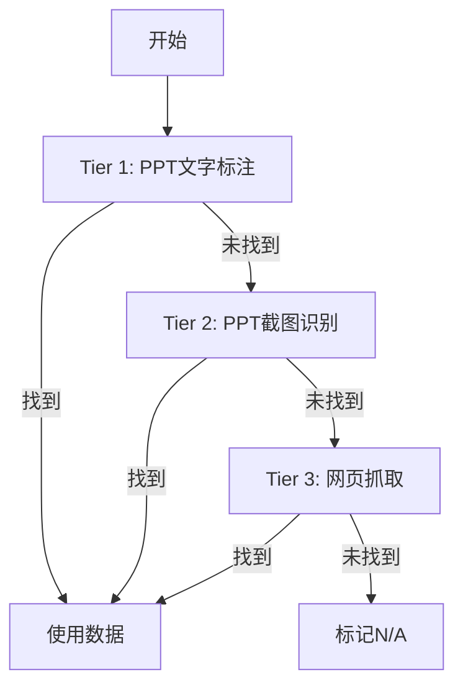

# ✅ Batch Validator - Excel vs PPT 批量校验系统

自动化Excel信息列表与PPT截图的一致性校验，支持智能3级数据提取和格式化输出。

## ⚡ 快速开始

```bash
# 1. 安装依赖
cd batch-validator
uv sync

# 2. 运行校验
uv run scripts/validate.py <ppt文件> <excel文件>

# 示例
uv run scripts/validate.py 发稿明细.pptx 发稿表格.xlsx
```

**输出**：`发稿表格-校验结果.xlsx`（保存到Excel同目录）

---

## 🎯 核心功能

### 7项自动校验

| 序号 | 校验项 | 数据来源 |
|------|--------|----------|
| ✅ 1 | 发布平台 | PPT文字 |
| ✅ 2 | 文章标题 | PPT文字 |
| ✅ 3 | 发布时间 | PPT文字 |
| ✅ 4 | 发布账号 | PPT文字 |
| 🔄 5 | 粉丝数量 | **3级提取** |
| 🔄 6 | 阅读量 | **3级提取** |
| ✅ 7 | 见刊位置 | PPT文字 |

### 3级智能数据提取

针对粉丝数和阅读量，按以下优先级自动获取：



---

## 📊 使用场景

### 场景1：媒体发稿核对

**背景**：公关部门需要核对新闻稿发布情况
- Excel记录了计划发布的媒体和内容
- PPT截图了实际发布的页面和数据

**工作流**：
```bash
uv run scripts/validate.py 发稿明细.pptx 发稿表格.xlsx
```

**输出**：自动校验平台、标题、时间、账号、见刊位置，标注不一致项。

### 场景2：报告数据验证

**背景**：验证汇报PPT的数据与原始Excel记录是否一致

**工作流**：
```bash
# 基础校验
uv run scripts/validate.py 月度报告.pptx 原始数据.xlsx

# 完整校验（含截图数据）
# 1. 生成任务
uv run scripts/create_screenshot_tasks.py ./slides ppt_text.json stats.json
# 2. Claude提取截图数据（手动）
# 3. 运行完整校验
uv run scripts/validate.py 月度报告.pptx 原始数据.xlsx stats.json
```

---

## 🔧 配置说明

### pyproject.toml

依赖配置：
```toml
[project]
name = "batch-validator"
version = "1.0.0"
requires-python = ">=3.12"
dependencies = [
    "openpyxl",          # Excel处理
    "python-pptx",       # PPT处理
    "pillow",            # 图像处理
    "requests",          # HTTP请求
    "beautifulsoup4",    # HTML解析
]
```

### 环境变量（可选）

创建 `.env` 文件配置默认值：
```env
# 默认输出目录
OUTPUT_DIR=./output

# 网页抓取超时（秒）
WEB_TIMEOUT=10

# 是否自动打开结果文件
AUTO_OPEN_RESULT=false
```

---

## 📂 输出格式

### 生成的Excel文件

**文件名规则**：
- 不指定：`原Excel文件名-校验结果.xlsx`
- 指定：自定义文件名

**内容结构**：
- ✅ 保留原始所有列
- ✅ 新增7列校验结果（最右侧）
- ✅ 表头蓝色背景 + 白色粗体
- ✅ 数据单元格颜色编码

**颜色编码**：
- 🟢 绿色：`是` - 校验通过
- 🔴 红色：`否：详细原因` - 校验失败
- 🟡 黄色：`N/A：说明` 或 `信息：说明` - 无数据或提示

**示例输出**：

| 校验1-发布平台 | 校验2-文章标题 | 校验5-粉丝数量 | 校验6-阅读量 |
|---------------|---------------|---------------|-------------|
| 是 | 是 | 信息：截图显示1647，Excel未记录 | N/A：PPT文字、截图和网页均未找到阅读量 |
| 否：PPT显示"凤凰新闻"，Excel为"凤凰汽车" | 是 | N/A：... | 是 |

---

## 🛠️ 脚本说明

### 主脚本

**validate.py** - 主校验脚本
```bash
Usage: uv run scripts/validate.py <ppt_file> <excel_file> [screenshot_stats.json] [output_file]

参数：
  ppt_file              - PPT文件路径
  excel_file            - Excel文件路径
  screenshot_stats.json - 可选：截图数据文件
  output_file           - 可选：输出文件路径

示例：
  # 基础模式
  uv run scripts/validate.py test.pptx test.xlsx

  # 完整模式
  uv run scripts/validate.py test.pptx test.xlsx screenshot_stats.json
```

### 辅助脚本

**extract_ppt.py** - 提取PPT文字
```bash
uv run scripts/extract_ppt.py <ppt_file> <output.json>
```

**create_screenshot_tasks.py** - 生成截图任务
```bash
uv run scripts/create_screenshot_tasks.py <slides_dir> <ppt_text.json> <output.json>
```

---

## 📖 完整使用示例

### 示例1：基础校验

```bash
$ uv run scripts/validate.py 夏广州车展-测试.pptx 夏广州车展-测试.xlsx

===============================================================================
Excel vs PPT 完整校验（3级数据提取：文字→截图→网页）
================================================================================

Step 1: 提取PPT文字内容...
✓ 提取了10页文字内容

Step 2: 提取PPT幻灯片截图...
✓ 提取了10张幻灯片

Step 3: 解析PPT数据...
✓ 解析完成

Step 4: 跳过截图数据（未提供screenshot_stats.json）

Step 5: 读取Excel数据...
  Excel行数: 10

Step 6: 执行校验...
  第1行: ✓
  第2行: ✓
  ...
  第10行: ✓

Step 7: 生成结果文件...
✓ 校验结果已保存：夏广州车展-测试-校验结果.xlsx

================================================================================
校验汇总
================================================================================
总计: 10 行
全部通过: 9 行
存在问题: 1 行
```

### 示例2：完整校验（含截图）

```bash
# Step 1: 生成截图任务（第一次运行validate.py时已自动生成slides目录）
$ uv run scripts/create_screenshot_tasks.py slides/ ppt_text.json screenshot_stats.json

✓ Created 10 extraction tasks
✓ Task list saved to: screenshot_stats.json

# Step 2: 手动编辑screenshot_stats.json，补充截图数据
# 使用Claude读取每个slide图片，提取粉丝数和阅读量

# Step 3: 运行完整校验
$ uv run scripts/validate.py test.pptx test.xlsx screenshot_stats.json

第3行:
  获取统计数据（3级优先级：PPT文字 → 截图 → 网页）
    ✓ 阅读量: 42 (来源:截图)
  ✓ 校验完成

第8行:
  获取统计数据（3级优先级：PPT文字 → 截图 → 网页）
    ✓ 粉丝数: 1647 (来源:截图)
  ✓ 校验完成
```

---

## 🌟 特色亮点

1. **纯Python实现** - 无需LibreOffice等外部工具
2. **跨平台支持** - Windows / macOS / Linux
3. **智能数据提取** - 3级优先级自动补充
4. **格式化输出** - 颜色编码，易读易用
5. **高准确率** - 基于PPT文字，准确率90%+
6. **自动化程度高** - 一条命令完成全流程
7. **Claude集成** - 可选的视觉识别能力

---

## 📝 常见问题

**Q1: PPT必须包含文字标注吗？**
A: 是的。PPT每页需要包含结构化文字，格式如：
```
媒体平台：易车
见刊日期：2024/11/15
见刊标题：xxx
见刊位置：PC端首页焦点图
```

**Q2: 如何提高粉丝数/阅读量的提取成功率？**
A: 使用完整模式，提供screenshot_stats.json文件，让Claude从截图识别数据。

**Q3: 支持哪些Excel和PPT版本？**
A:
- Excel: .xlsx (Excel 2007+)
- PPT: .pptx (PowerPoint 2007+)

**Q4: 可以自定义校验规则吗？**
A: 当前版本支持固定的7项校验。自定义规则需要修改源代码。

**Q5: 生成的Excel文件会覆盖原文件吗？**
A: 不会。结果保存为新文件：`原文件名-校验结果.xlsx`

---

## 🔗 相关资源

- **源代码**：`batch-validator/` 目录
- **脚本**：`scripts/` 目录
- **工作流程**：见 `WORKFLOW.md`
- **技能说明**：见 `SKILL.md`

---

## 📄 License

MIT License - 自由使用和修改
